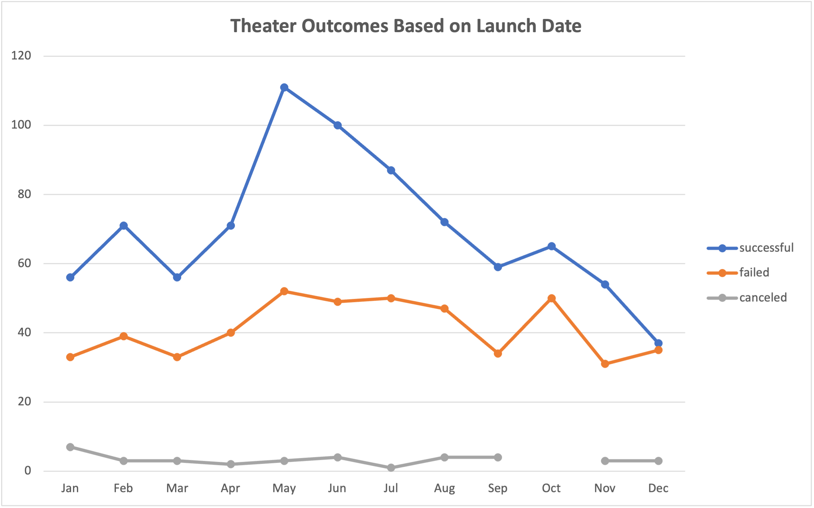
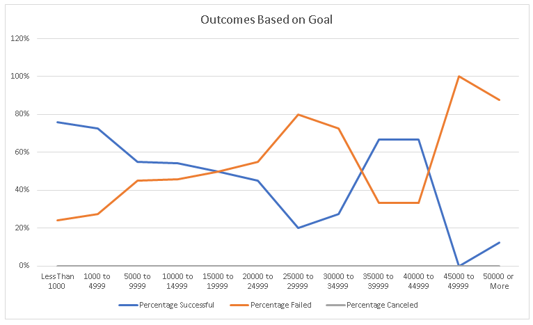

# Kickstarting with Excel

## Overview of Project
The overview of this project is to go over kickstarter data regarding theater production.
### Purpose
The purpose of this analysis is to analyze kickstarter data to view outcomes based off launch date and goals. 
## Analysis and Challenges
Performed analysis by creating two different charts. 

### Analysis of Outcomes Based on Launch Date

  

Chart showing theater outcomes that are successful, failed, and, canceled based on launch date

### Analysis of Outcomes Based on Goals

Graph showing outcomes based on goals showing the percentage of successful and failed outcomes. 

### Challenges and Difficulties Encountered

A challenge that was encountered was finding out how to add the ranges in the COUNTIFS formula in the Outcomes Based on Goals spreadsheet.
Another possible challenge could be converting the Unix timestamps if one does not know how to do so. 
## Results

- What are two conclusions you can draw about the Outcomes based on Launch Date?

    The best month to launch is in May or June.
Advise not to launch in October. 

- What can you conclude about the Outcomes based on Goals?

    Based of the data in outcomes based on goals it is best to launch a kickstart with a goal of less than $4,999.
- What are some limitations of this dataset?

    Some limitations of the original data is that the dates are in Unix timestamps and would need to be converted.
- What are some other possible tables and/or graphs that we could create?

    Possible graphs that could be used is a combo clustered bar chart in the outcomes bases on goals spreadsheet to show the percentages of successful and failed goals. 